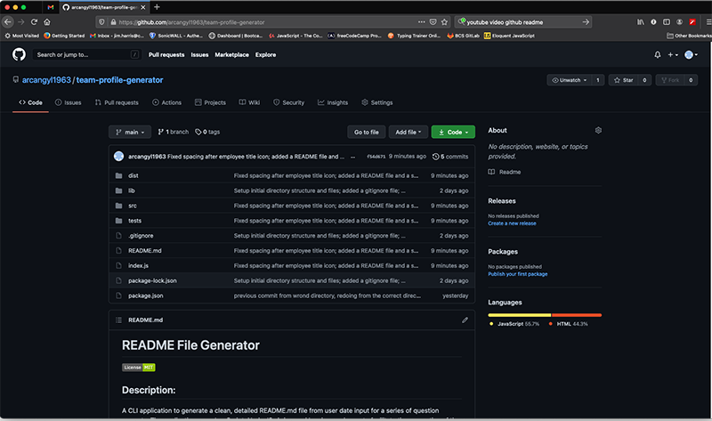

# Team Profile Generator 

 

## Description: 

Team Profile Generator is a  CLI application that generates a team profile HTML page from user input to a series of question prompts for information regarding the team members. The application uses JavaScript, Node.JS, FS, Inquirer and Jest packages to facilitate the generation of the file and testing of the application. Inquirer prompts are used to display the questions to the user and collect the input data. Node.JS is the framework within which the application runs. FS or File System writes the collected data to the HTML file utilizing helper templates. 

The application is intended to give the user a quick, easy way to input their team members' information based on the prompts and generate a simple, functional web page with the team members information, email contacts and links to their GitHub projects when available. 

---

## Table of Contents 

[Installation](#installation) 

[Usage](#usage) 

[License](#license) 

[Contributors](#contributors) 

[Tests](#tests) 

[Questions](#Questions) 

---

## Installation: 

My files can be accessed in the repository [HERE](https://github.com/arcangyl1963/team-profile-generator) 

The image below shows the repository where my project files are located:

Install the application by cloning the repo from the link above or by downloading the files to your local drive.

The repository will contain all of the files needed to run the application:

* A 'dist' directory containing output HTML files generated by the application and any assets required such as images or CSS files.
* A 'lib' directory with the classes modules.
* A 'src' directory containing the HTML helper templates.
* A 'tests' directory containing the four test scripts for each class.
* A package.json file that contains the dependencies required for the application to run and the testing script path.
* An index.js script file that is the core of the application which the user invokes to run the application.

First begin by installing any dependencies required to run the application and to setup the development environment on your local repository. 

In Terminal or a similar bash command-line utility, navigate to the working directory and enter: 

~~~
npm install OR npm i
~~~

This will install any package dependencies defined in the package.json file.
Once the required packages have been installed, the application can be launched.

---

## Usage: 
To launch the application type the following into Terminal or the command-line utility of your choice:

~~~
node index.js
~~~

The first question prompt will appear if the launch is successful. Read each question carefully and enter your answers for each prompt.

The first prompt asks you to enter the number of members on your team. This serves as a means to validate at least one member is entered as well as control the display of the question prompts. The next prompt will display after you enter a reponse to the previous question. You will answer the same set of questions for each team member based on the number you enter in response to the first prompt.

Note that each team member role will have one question unique to that role:
* If manager is selected, the user will be prompted to enter the manager's office number.
* When engineer is selected, the user will be prompted to enter the engineer's GitHub username.
* If intern is selected, the user will be prompted to enter the name of the school the intern was attending or attended. 

When the 'myteam.html' file has been successfully created, a prompt appears noting the success. 

You may also watch a brief walk-through video explaining each step:  

---

## License: 

 This software is licensed under an MIT license:  Copyright © 2021 Arcangyl Studios  Permission is hereby granted, free of charge, to any person obtaining a copy of this software and associated documentation files (the 'Software'), to deal in the Software without restriction, including without limitation the rights to use, copy, modify, merge, publish, distribute, sublicense, and/or sell copies of the Software, and to permit persons to whom the Software is furnished to do so, subject to the following conditions: The above copyright notice and this permission notice shall be included in all copies or substantial portions of the Software. THE SOFTWARE IS PROVIDED 'AS IS', WITHOUT WARRANTY OF ANY KIND, EXPRESS OR IMPLIED, INCLUDING BUT NOT LIMITED TO THE WARRANTIES OF MERCHANTABILITY, FITNESS FOR A PARTICULAR PURPOSE AND NONINFRINGEMENT. IN NO EVENT SHALL THE AUTHORS OR COPYRIGHT HOLDERS BE LIABLE FOR ANY CLAIM, DAMAGES OR OTHER LIABILITY, WHETHER IN AN ACTION OF CONTRACT, TORT OR OTHERWISE, ARISING FROM, OUT OF OR IN CONNECTION WITH THE SOFTWARE OR THE USE OR OTHER DEALINGS IN THE SOFTWARE. 

---

## Contributors: 

James Harris 

---

## Tests: 

There were 4 tests created for each of the classes. All 4 tests passed during testing. 
To run the tests, enter the following command into Terminal or command-line bash utility of your choice: 

~~~
npm test
~~~

---

## Questions: 

- Feel free to email me with any questions about this project at: arcangyl@gmail.com 

 

- My GitHub profile may be viewed by clicking [here](https://github.com/arcangyl1963).